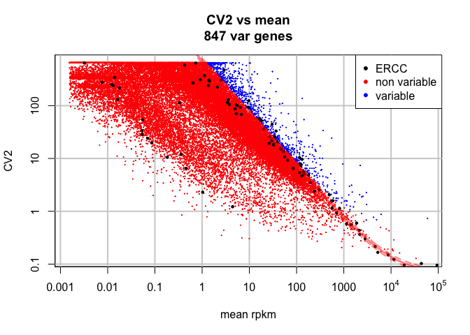
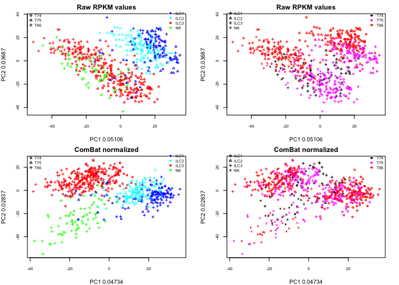
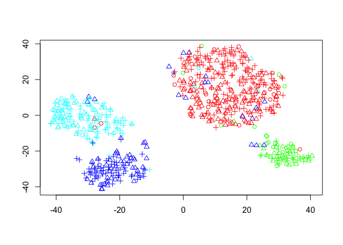
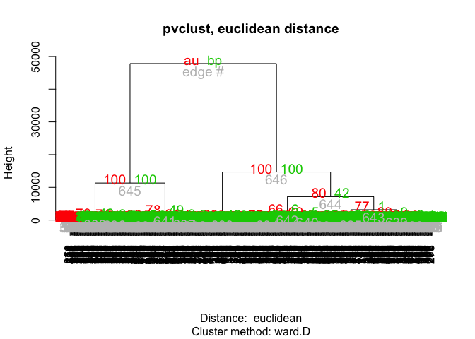
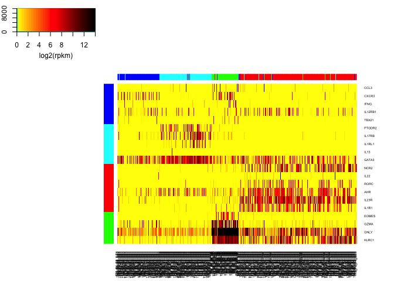
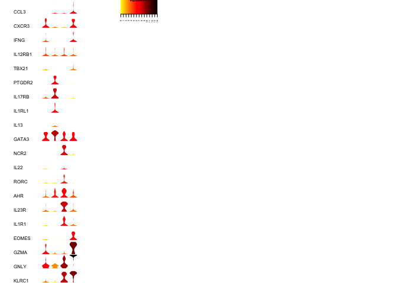
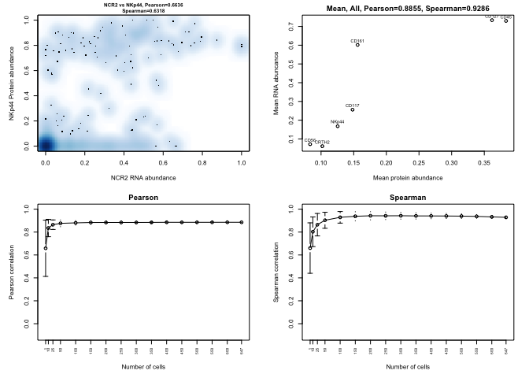
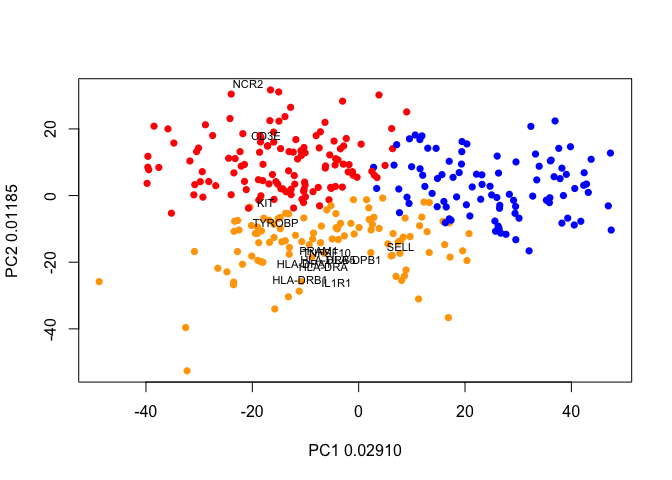
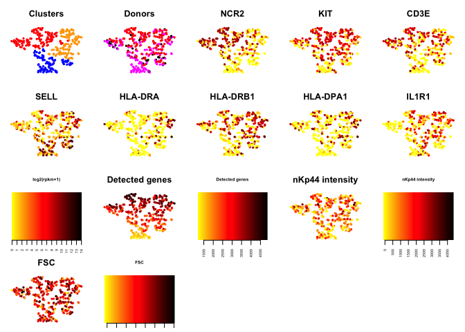

This is the code used for the single cell analyses of the manuscript
"The heterogeneity of human CD127+ innate lymphoid cells revealed by
single-cell RNA sequencing" Björklund ÅK et al.

Many of the parts that takes a long time have been set as optional where
you can select to run them, or load the output files from the "data"
directory. Please change the variables force.combat, force.tsne,
force.pvclust and force.tsne\_ilc3 to TRUE to rerun those parts of the
code.

Written by Åsa K. Björklund, 2015, <asa.bjorklund@scilifelab.se>

Dependencies
------------

#### Cran packages:

statmod, gplots, plotrix, Rtsne, MASS, vioplot, pvclust

#### Bioconductor:

sva

#### Other:

Standard pvclust package only uses spearman correlatioin, but there is
an unofficial version at
<http://www.is.titech.ac.jp/~shimo/prog/pvclust/pvclust_unofficial_090824.zip>
that also includes euklidean distance.

SCDE (<http://hms-dbmi.github.io/scde/>)

Load some custom functions that are included in bin folder:

    source("bin/functions.r")

Define color/point styles based on celltype or tonsil origin
------------------------------------------------------------

    infile = "data/ensembl_rpkmvalues_ILC.txt"
    RPKM<-read.table(infile)
    nS<-ncol(RPKM)
    nG<-nrow(RPKM)

    # define the colors for tonsil/celltype
    pchdef<-1:4
    tonsils<-c("T74","T75","T86")
    coldef.ton<-c("black","magenta","red")
    celltypes<-c("ILC1","ILC2","ILC3","NK")
    coldef.cell<-c("blue","cyan","red","green")

    # split names to get tonsil origin
    cell<-unlist(lapply(strsplit(colnames(RPKM),"_"), function(x) x[4]))
    ton<-unlist(lapply(strsplit(colnames(RPKM),"_"), function(x) x[1]))

    # OBS! 6 cells from T75 P2,3 have the wrong classification by surface phenotype, change here
    redef<- c("ILC1","ILC2","ILC1","ILC1","ILC1","ILC1")
    redef.samples <- c("T75_P1_C6_ILC3","T75_P1_E11_ILC3","T75_P1_F4_ILC3","T75_P2_H11_ILC3","T75_P2_H2_ILC3","T75_P1_H4_ILC3")
    cell[match(redef.samples,colnames(RPKM))]<-redef

    # make lists for the celltypes/tonsils
    sets.cell<-make_sets(cell)
    sets.ton<-make_sets(ton)

    # create color vector
    col.ton<-make_colors(ton,tonsils,coldef.ton)
    col.cell<-make_colors(cell,celltypes,coldef.cell)
    pch.ton<-make_colors(ton,tonsils,pchdef)
    pch.cell<-make_colors(cell,celltypes,pchdef)

    # save to a file for later use
    outfile<- 'data/coldef_pchdef_by_FACS.Rdata'
    save(pchdef,tonsils,coldef.ton,celltypes,coldef.cell,col.ton,col.cell,pch.ton,pch.cell,sets.ton,sets.cell,file=outfile)

Find variable genes
-------------------

Plot coefficient of variation vs mean and detect genes with biological
variation, adapted from Brenneke et.al.

    ercc<-grep("ERCC_",rownames(RPKM))

    var.genes<-cv2.var.genes(RPKM[-ercc,],RPKM[ercc,],plot=T)

    var.idx <- which(var.genes)
    gene.names<-rownames(RPKM[-ercc,])[var.idx]
    write.table(cbind(gene.names,var.idx),file="data/variable_genes_allcells.txt")

Remove batch effect
-------------------

The raw data shows a clear batch effect with cells from each of the 3
tonsil donors grouping separately. Use the SVA ComBat function to remove
this batch effect. OBS! Takes a long time to run, so the option of
loading the file instead has been added.

    library(sva)

    savefile<-"data/combat_normalized.RData"
    force.combat<-FALSE
    if (!file.exists(savefile) || force.combat){
      cellcov<-mat.or.vec(nS,1)
      for (i in 1:4 ) {
         c<-celltypes[i]
         cellcov[sets.cell[[c]]]<-i
      }

      batchT<-as.numeric(pch.ton)
      typeT<-as.numeric(cellcov)
      pdT<-data.frame(sample=1:nS,batch=batchT,type=typeT)
      mod0<-model.matrix(~1, data=pdT)

      Rtemp<-log2(RPKM+0.1)
      cb0 = ComBat(dat=Rtemp, batch=batchT,mod=mod0,par.prior=FALSE)
      save(cb0,file=savefile)
    }else{
      load(savefile) 
    }

PCA before and after batch effect removal
-----------------------------------------

    par(mfrow=c(2,2),mar=c(4,4,2,2),xpd=T,cex.axis=0.7,cex=0.6)
    # first with raw rpkm values
    PC1<-pca.plot(RPKM[var.idx,],log.vals=T,main="Raw RPKM values",col=col.cell,pch=pch.ton,cex=0.6)
    legend("topright",legend=celltypes,fill=coldef.cell,border=F,bty='n',cex=0.7,inset=c(0,-0.05))
    legend("topleft",legend=tonsils,pch=pchdef,bty='n',cex=0.7,inset=c(0,-0.03))
    pca.plot(PC1,main="Raw RPKM values",col=col.ton,pch=pch.cell,cex=0.6)
    legend("topright",legend=tonsils,fill=coldef.ton,border=F,bty='n',cex=0.7,inset=c(0,-0.03))
    legend("topleft",legend=celltypes,pch=pchdef,bty='n',cex=0.7,inset=c(0,-0.05))

    # then after ComBat normalization with rpkm values
    PC2<-pca.plot(cb0[var.idx,],log.vals=F,main="ComBat normalized",col=col.cell,pch=pch.ton,cex=0.6)
    legend("topright",legend=celltypes,fill=coldef.cell,border=F,bty='n',cex=0.7,inset=c(0,-0.05))
    legend("topleft",legend=tonsils,pch=pchdef,bty='n',cex=0.7,inset=c(0,-0.03))
    pca.plot(PC2,main="ComBat normalized",col=col.ton,pch=pch.cell,cex=0.6)
    legend("topright",legend=tonsils,fill=coldef.ton,border=F,bty='n',cex=0.7,inset=c(0,-0.03))
    legend("topleft",legend=celltypes,pch=pchdef,bty='n',cex=0.7,inset=c(0,-0.05))

Run tSNE
--------

Run tSNE (Barnes-Hut tSNE in Rtsne package), using 10 first principal
components as input. Tsne was run for 20 iterations since the results
are slightly differen each time. The results are stored in a list RES.

    library(Rtsne)

    savefile1 <- "data/tsne_10Pc_20i.Rdata"
    force.tsne<-FALSE
    if (!file.exists(savefile1) || force.tsne){
      C<-cb0[var.genes,]
      RES<-list()
      pdf("figures/tsne_10PC_20i.pdf")
      par(mfrow=c(4,4),mar=c(1,1,3,1))
      for (i in 1:20){
           tsne.out10<- Rtsne(t(C),initial_dims=10,dims=2,theta=0.001)
           plot(tsne.out10$Y,col=col.cell,pch=pch.ton,ylab='',xlab='')
           RES[[i]]<-tsne.out10
      }
      dev.off()
      save(RES, file=savefile1)
    }else{
      load(savefile1)   
    }

    plot(RES[[1]]$Y,col=col.cell,pch=pch.ton,ylab='',xlab='')

Bootstrapped clustering with pvclust
------------------------------------

pvclust based on euclidean distances instead of correlations are done

    library(pvclust)
    library(MASS)

    Rsum<-Reduce("cbind",lapply(RES,function(x) x$Y))

    savefile2<-"data/pvclust_euclidean_10PC_20i.Rdata"
    force.pvclust<-FALSE
    if (!file.exists(savefile2) || force.pvclust){
       bhc<-pvclust(t(Rsum), method.hclust="ward",method.dist="euclidean")
       save(bhc,file=savefile2)
    }else {
       load(savefile2)
    }

Define cluster groups
---------------------

    groups<-cutree(bhc$hclust,4)
    group.def<-c("ILC1","NK","ILC2","ILC3")
    cluster.groups<-mat.or.vec(1,nS)
    for (i in 1:4) {
        cluster.groups[groups==i]<-group.def[i]
    }

    write.table(cbind(cluster.groups[1,],colnames(RPKM)),file="data/cluster_groups_pvclust.txt")

    sets.cl<-make_sets(cluster.groups)
    col.cl<-make_colors(cluster.groups,celltypes,coldef.cell)

Plot dendrogram
===============

    plot(bhc,main="pvclust, euclidean distance",cex.pv=1.2)

Plot heatmap with hallmark genes
--------------------------------

Plot the genes in data/hallmark\_gene\_list.txt as a heatmap with cells
ordered by the pvclust dendrogram.

    # define colors:
    cc<-colorRampPalette(c("yellow","red","black"))
    cols<-cc(100)
    yrange<-c(0,14)
    colbr <- seq(yrange[1], yrange[2], len=101)

    # read in gene list
    G<-read.table("data/hallmark_gene_list.txt",sep="\t",header=T)
    gene.col<-make_colors(G[,1],celltypes,coldef.cell)
    gene.idx<-match(G[,3],rownames(RPKM))

    dendro<-as.dendrogram(bhc$hclust)
    library(gplots)
    h <- heatmap.2(log2(as.matrix(RPKM[gene.idx,])+1),col=cols,breaks=colbr,scale="none",
      trace="none",cexRow=0.5,cexCol=0.5,ColSideColors=col.cell,RowSideColors=gene.col,
      key.title=NA,key.xlab="log2(rpkm)", key.ylab=NA,Colv=dendro,Rowv=FALSE)

Plot violin plots
-----------------

This example code snippet takes the gene list
data/hallmark\_gene\_list.txt, but can be applied to any list of genes,
thus producing the violin plots in Figures 4-7 of the manuscript.

    crange.log<-seq(0,14,by=0.1)
    col.log<-cc(length(crange.log))
    R<-as.matrix(RPKM)

    par(mfcol=c(20,5),xpd=T,cex=0.5)
    par(mar=c(0,7,0,0))
    for (i in 1:nrow(G)){
        l<-lapply(sets.cl,function(x) R[gene.idx[i],x] )
        gname<-G[i,3]
        make.vioplot(l,name=gname,text.col=NA,ylim=yrange,horizontal=F)
    }
    plot.color.bar()

Protein and RNA comparison
--------------------------

All marker protein index data and log2(rpkm) values for the
corresponding mRNAs can be found in file
data/protein\_RNA\_data\_markers.txt

    D<-read.table('data/protein_RNA_data_markers.txt')

    # remove negative markers, NKG2A, CD16, FSC and SSC
    rem<-c(4,5,13,14,19,20)
    D<-D[,-rem]

    nS<-nrow(D)
    nD<-7
    prot.idx<-1:7
    rna.idx<-8:14
    markers<-colnames(D)[prot.idx]
    genes<-colnames(D)[rna.idx]

    tonsils<-c("T75","T74","T86")
    ton2 <-unlist(lapply(strsplit(rownames(D),"_"), function(x) x[1]))
    sets.ton2<-make_sets(ton2)

    # normalize data for each sort occation

    normdata<-mat.or.vec(nS,nD*2)
    for (t in names(sets.ton2)){
        d<-sets.ton2[[t]]
        normdata[d,]<-apply(D[d,],2,norm_distr)
    }

    # plot
    par(mfrow=c(2,2),cex=0.5,mar=c(5,5,2,2))
    # first nkp44, first column
    i<-1
    data<-normdata
    c<-cor(data[,i],data[,i+nD])
    cs<-cor(data[,i],data[,i+nD],method="spearman")
    smoothScatter(data[,i],data[,i+nD],xlab=sprintf("%s RNA abundance", genes[i]), ylab=sprintf("%s Protein abundance",markers[i]),main=sprintf("%s vs %s, Pearson=%.4f\nSpearman=%.4f",genes[i],markers[i],c,cs),cex.main=0.8)

    # then mean all
    plot_mean(normdata,"All")

    # then simplots with spearman, pearson
    run_simulation_plot(normdata,1000,noPar=TRUE)

Clustering of ILC3 cells
------------------------

All cells defined as ILC3 cells were clustered in a similar manner to
the whole dataset, using several iterations of tSNE and hierarchical
clustering, but the gene set used consisted of immune related genes
only.

    immune.data<-read.table("data/GO_immune_genes.txt")
    ilc3s<-sets.cl$ILC3
    c.temp<-cb0[immune.data[,2],ilc3s]

    library(Rtsne)

    savefile.ilc3<-"data/tsne_ilc3_50i.Rdata"
    force.ilc3_tsne<-FALSE
    if (!file.exists(savefile.ilc3) || force.ilc3_tsne){
      RES3<-list()
      for (i in 1:50){
        tsne.out<- Rtsne(t(c.temp),initial_dims=3,dims=2,perplexity=20,theta=0.1)
        RES3[[i]]<-tsne.out
      }
      save(RES3,file=savefile.ilc3)
    }else {
      load(savefile.ilc3)
    }

    Rsum<-Reduce("cbind",lapply(RES3,function(x) x$Y))
    hcl<-hclust(dist(Rsum),method="ward.D2")
    groups<-cutree(hcl,3)
    sets.ilc3<-make_sets(groups)
    coldef.ilc3<-c("red","blue","orange")
    col.ilc3<-make_colors(groups,1:3,coldef.ilc3)

PCA with ILC3 cells
-------------------

All cells defined as ILC3 cells were clustered in a similar manner to
the whole dataset, using several iterations of tSNE and hierarchical
clustering.

    PC<-pca.plot(c.temp,log.vals=F,col=col.ilc3,pch=16)

    # plot gene loadings onto plot
    loading.genes<- c("NCR2","TYROBP","KIT","CD3E","SELL","IL1R1","TNFSF10","PRAM1","HLA-DRA","HLA-DRB1","HLA-DRB5","HLA-DPA1","HLA-DPB1")
    loading.idx<-match(loading.genes,rownames(c.temp))
    data<-PC$x[,c(1,2)]
    rot<-PC$rotation[,c(1,2)]
    #multiplication factor
    mult <- min(
      (max(data[,2]) - min(data[,2])/(max(rot[,2])-min(rot[,2]))),
      (max(data[,1]) - min(data[,1])/(max(rot[,1])-min(rot[,1])))
    )
    v1<-rot[,1]*mult
    v2<-rot[,2]*mult
    text(v1[loading.idx],v2[loading.idx],rownames(c.temp)[loading.idx],cex=0.7,col="black")

tSNE plots for ICL3s colored by different markers
-------------------------------------------------

    ilc3.genes<-c("NCR2", "KIT", "CD3E", "SELL", "HLA-DRA", "HLA-DRB1", "HLA-DPA1", "IL1R1" )
    par(mfrow=c(4,5),mar=c(1,1,3,1))
    tsne.out<-RES3[[i]]
    plot(tsne.out$Y,col=col.ilc3,pch=16,main="Clusters",axes=F,xlab=F,ylab=F,cex=0.7)
    plot(tsne.out$Y,col=col.ton[ilc3s],pch=16,main="Donors",axes=F,xlab=F,ylab=F,cex=0.7)
    for (g in ilc3.genes){
      g.idx<-match(g,rownames(R))
      col.g<-convert.to.color(log2(R[g.idx,ilc3s]+1),cc,col.range=crange.log) 
      plot(tsne.out$Y,col=col.g$cols,main=g,axes=F,xlab=F,ylab=F,pch=16,cex=0.7)   
    }
    plot.color.bar()

    # detected genes
    nDet<-apply(R[,ilc3s],2,function(x) length(which(x>1)))
    cols.nDet<-convert.to.color(nDet,cc)
    plot(tsne.out$Y,col=cols.nDet$cols,main="Detected genes",axes=F,xlab=F,ylab=F,pch=16,cex=0.7)
    plot.color.bar(col=cols.nDet$col.def,crange=cols.nDet$col.range,main="Detected genes")

    # NKp44
    D<-read.table('data/protein_RNA_data_markers.txt')
    nkp44<-D[rownames(D) %in% colnames(R)[ilc3s],1]
    cols.nkp44<-convert.to.color(nkp44,cc)
    plot(tsne.out$Y,col=cols.nkp44$cols,main="nKp44 intensity",axes=F,xlab=F,ylab=F,pch=16,cex=0.7)
    plot.color.bar(col=cols.nkp44$col.def,crange=cols.nkp44$col.range,main="nKp44 intensity")

    # Forward scattering
    cols.fsc <- convert.to.color(D[rownames(D) %in% colnames(R)[ilc3s],19],cc)
    plot(tsne.out$Y,col=cols.fsc$cols,main="FSC",axes=F,xlab=F,ylab=F,pch=16,cex=0.7)
    plot.color.bar(col=cols.fsc$col.def,crange=cols.fsc$col.range,main="FSC")

Finally, the session info:

    sessionInfo()

    ## R version 3.2.2 (2015-08-14)
    ## Platform: x86_64-apple-darwin13.4.0 (64-bit)
    ## Running under: OS X 10.10.5 (Yosemite)
    ## 
    ## locale:
    ## [1] C
    ## 
    ## attached base packages:
    ## [1] stats     graphics  grDevices utils     datasets  methods   base     
    ## 
    ## other attached packages:
    ##  [1] vioplot_0.2       sm_2.2-5.4        gplots_2.17.0    
    ##  [4] MASS_7.3-45       Rtsne_0.10        sva_3.14.0       
    ##  [7] genefilter_1.50.0 mgcv_1.8-9        nlme_3.1-122     
    ## [10] statmod_1.4.22   
    ## 
    ## loaded via a namespace (and not attached):
    ##  [1] Rcpp_0.12.2          formatR_1.2.1        GenomeInfoDb_1.4.3  
    ##  [4] bitops_1.0-6         tools_3.2.2          digest_0.6.8        
    ##  [7] annotate_1.46.1      evaluate_0.8         RSQLite_1.0.0       
    ## [10] lattice_0.20-33      Matrix_1.2-2         DBI_0.3.1           
    ## [13] yaml_2.1.13          parallel_3.2.2       stringr_1.0.0       
    ## [16] knitr_1.11           caTools_1.17.1       gtools_3.5.0        
    ## [19] S4Vectors_0.6.6      IRanges_2.2.9        stats4_3.2.2        
    ## [22] grid_3.2.2           Biobase_2.28.0       AnnotationDbi_1.30.1
    ## [25] XML_3.98-1.3         survival_2.38-3      rmarkdown_0.8.1     
    ## [28] gdata_2.17.0         magrittr_1.5         htmltools_0.2.6     
    ## [31] BiocGenerics_0.14.0  splines_3.2.2        xtable_1.8-0        
    ## [34] KernSmooth_2.23-15   stringi_1.0-1
